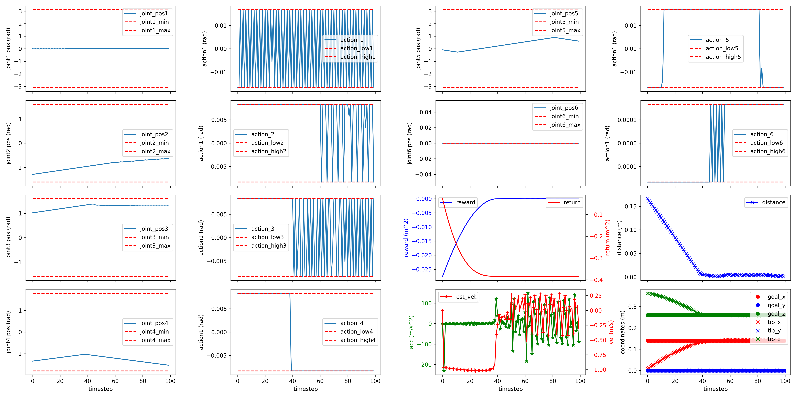
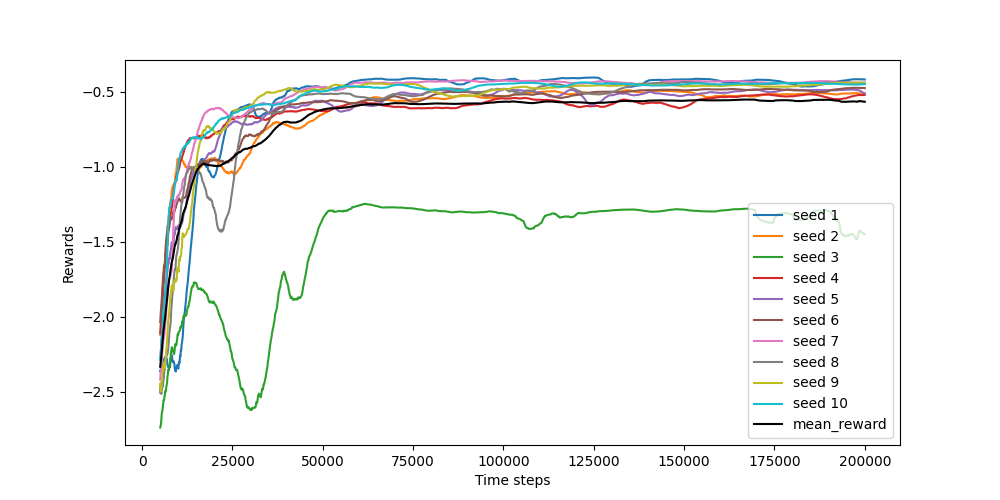
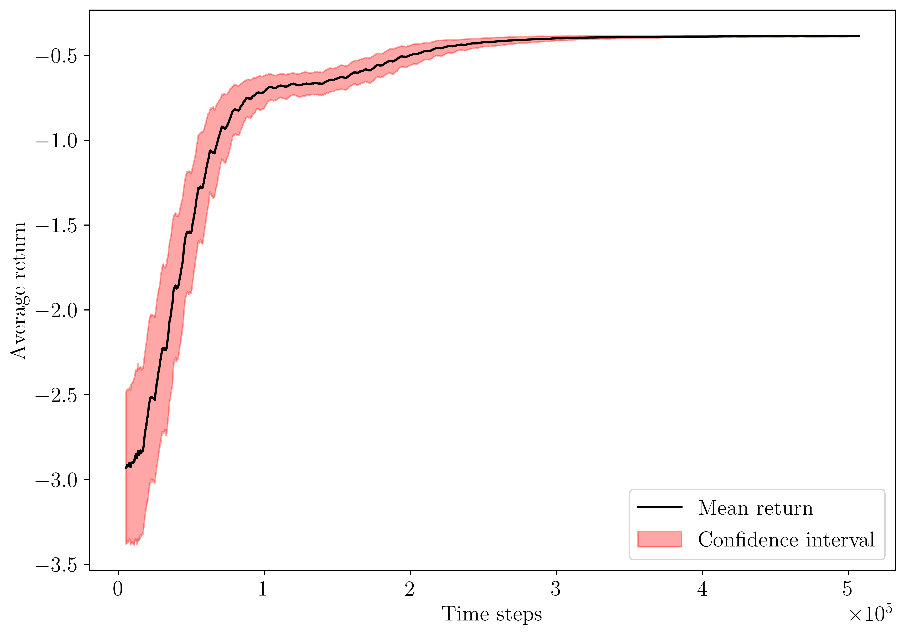

*************************
Evaluate trained policies
*************************

With the local installation
===========================

Trained models can be evaluated and the results can be saved with the script ``evaluate_policy.py``.

.. csv-table:: Usage
   :header:  Flag , Description , Type , Example 

   ``--exp-id``,	Unique experiment ID,	*int*,	99
   ``--n-eval-steps``,	Number of evaluation timesteps,	*int*,	1000
   ``--log-info``,	Enable information logging at each evaluation steps,	*bool*,	0 (default) or 1
   ``--plot-dim``,	Live rendering of end-effector and goal positions,	*int*,	0: do not plot (default), 2: 2D or 3: 3D
   ``--render``,	Render environment during evaluation,	*bool*,	0 (default) or 1

Example:

.. code-block:: bash

   python evaluate_policy.py --exp-id 99 --n-eval-steps 1000 --log-info 0 --plot-dim 0 --render 0

The plots are printed in the associated experiment folder, e.g. `logs/exp_99/ppo/`.

If ``--log-info`` was enabled during evaluation, it is possible to plot some useful information as shown in the plot below.

.. code-block:: bash

   python scripts/plot_episode_eval_log.py --exp-id 99

An example of environment evaluation plot:

An example of experiment learning curve:

With Docker
===========

Trained policies can be evaluated from the Docker containers. The result files and plots will generated in the working directory of the host machine.

.. code-block:: bash

   # CPU
   docker run -it --rm --network host --ipc=host --mount src=$(pwd),target=/root/rl_reach/,type=bind rlreach/rlreach-cpu:latest bash -c "python evaluate_policy.py --exp-id 99 --n-eval-steps 1000 --log-info 0 --plot-dim 0 --render 0"
   # GPU 
   docker run -it --rm --runtime=nvidia --network host --ipc=host --mount src=$(pwd),target=/root/rl_reach/,type=bind rlreach/rlreach-gpu:latest bash -c "python evaluate_policy.py --exp-id 99 --n-eval-steps 1000 --log-info 0 --plot-dim 0 --render 0"

A Shell script is provided for ease of usability.

.. code-block:: bash

   # CPU
   ./docker/run_docker_cpu.sh python evaluate_policy.py --exp-id 99 --n-eval-steps 1000 --log-info 0 --plot-dim 0 --render 0
   # GPU 
   ./docker/run_docker_gpu.sh python evaluate_policy.py --exp-id 99 --n-eval-steps 1000 --log-info 0 --plot-dim 0 --render 0

Reset the repository
====================

It can sometimes be convenient to clean all the results and log files and reset the repository. This can be done with the following Shell script.

.. code-block:: bash

   ./cleanAll.sh

.. warning::

   Warning, this cannot be undone!