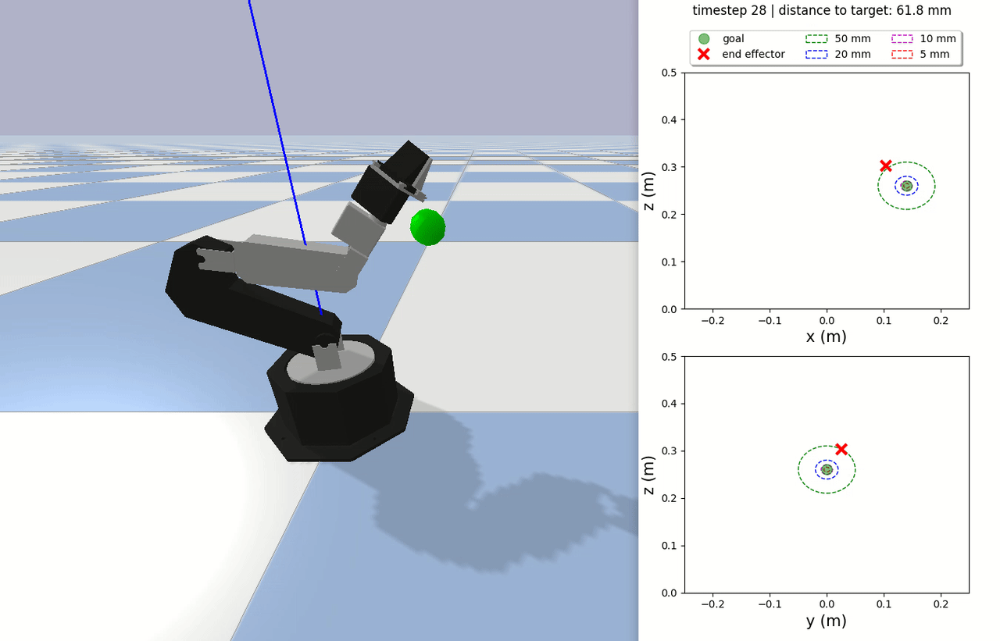

*************************
Training environments
*************************

A number of custom Gym environments are available in the `gym_envs` directory. 
They simulate the WidowX MK-II robotic manipulator with the Pybullet physics engine. 
The objective is to bring the end-effector as close as possible to a target position.

Each implemented environment is described 
`here <https://github.com/PierreExeter/rl_reach/blob/master/code/gym_envs/widowx_env/envs_list.csv>`_. 
The action, observation and reward functions are given in 
`this document <https://github.com/PierreExeter/rl_reach/blob/master/code/gym_envs/widowx_env/reward_observation_action_shapes/reward_observation_action.pdf>`_.
